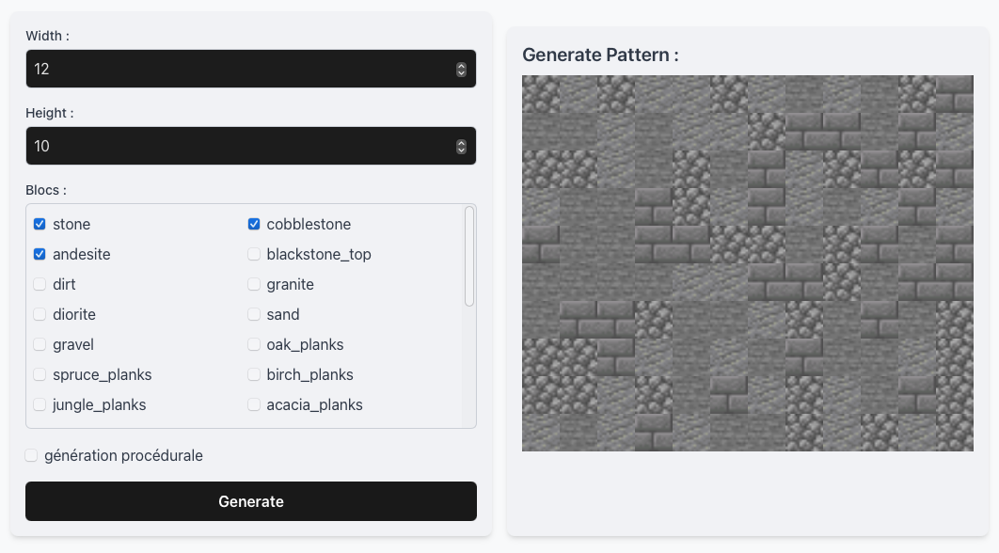

# Minecraft-Patern-Generator



## Description

 Create your own minecraft patern with all blocks

## Live Demo

Check out the live demo of the project [here](https://tixeo.github.io/Minecraft-Patern-Generator/).

## Table of Contents

- [Description](#description)
- [Live Demo](#live-demo)
- [Installation](#installation)
- [Contact](#contact)

## Installation

If someone wants to run your project locally, they can follow these steps:

1. Clone the repository:
    ```bash
    git clone https://github.com/Tixeo/Minecraft-Patern-Generator.git
    ```
2. Navigate to the project directory:
    ```bash
    cd Minecraft-Patern-Generator
    ```
3. Install the dependencies (if any):
    ```bash
    npm install
    ```
4. Start the development server:
    ```bash
    npm run dev
    ```
5. Open your browser and go to `http://localhost:5173`.

## Contact

If you have any questions :

- Discord : tixeo#0000
- GitHub: [Tixeo](https://github.com/Tixeo)
